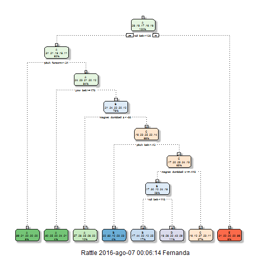

## Background

Using devices such as Jawbone Up, Nike FuelBand, and Fitbit it is now possible to collect a large amount of data about personal activity relatively inexpensively. These type of devices are part of the quantified self movement - a group of enthusiasts who take measurements about themselves regularly to improve their health, to find patterns in their behavior, or because they are tech geeks. One thing that people regularly do is quantify how much of a particular activity they do, but they rarely quantify how well they do it. In this project, your goal will be to use data from accelerometers on the belt, forearm, arm, and dumbell of 6 participants. We were asked to perform barbell lifts correctly and incorrectly in 5 different ways.

##Data 

The training data for this project are available here: 

https://d396qusza40orc.cloudfront.net/predmachlearn/pml-training.csv

The test data are available here:

https://d396qusza40orc.cloudfront.net/predmachlearn/pml-testing.csv

The data for this project come from this source: http://groupware.les.inf.puc-rio.br/har. If you use the document you create for this class for any purpose please cite them as they have been very generous in allowing their data to be used for this kind of assignment. 


The goal of this assignment is to predict the manner in which they did the exercise. This assignment will:

a.create a report describing how the model is built

b.how cross validation is use

c.what is the expected out of sample error and why we made the choices we did

d.use prediction model to predict 20 different test cases


Once downloaded to our working directory, we read in the file to perform some basic exploratory data analysis. We notice there are many blanks and NA values (I do not show here in the interest of space), so I shall re-read the file so that all non-valid entries (blanks, DIV/0, NA), are read in as NA in R. I continue to examine and remove columns which contain NA's, as well as remove columns which I do not believe have any outcome on the class.


```r
datatraining=read.csv('pml-training.csv',na.strings=c('','NA','#DIV/0!'))
datatraining=datatraining[,apply(datatraining,2,function(x) !any(is.na(x)) )]
datatraining=datatraining[,-c(1:7)]

names(datatraining)
```

```
##  [1] "roll_belt"            "pitch_belt"           "yaw_belt"            
##  [4] "total_accel_belt"     "gyros_belt_x"         "gyros_belt_y"        
##  [7] "gyros_belt_z"         "accel_belt_x"         "accel_belt_y"        
## [10] "accel_belt_z"         "magnet_belt_x"        "magnet_belt_y"       
## [13] "magnet_belt_z"        "roll_arm"             "pitch_arm"           
## [16] "yaw_arm"              "total_accel_arm"      "gyros_arm_x"         
## [19] "gyros_arm_y"          "gyros_arm_z"          "accel_arm_x"         
## [22] "accel_arm_y"          "accel_arm_z"          "magnet_arm_x"        
## [25] "magnet_arm_y"         "magnet_arm_z"         "roll_dumbbell"       
## [28] "pitch_dumbbell"       "yaw_dumbbell"         "total_accel_dumbbell"
## [31] "gyros_dumbbell_x"     "gyros_dumbbell_y"     "gyros_dumbbell_z"    
## [34] "accel_dumbbell_x"     "accel_dumbbell_y"     "accel_dumbbell_z"    
## [37] "magnet_dumbbell_x"    "magnet_dumbbell_y"    "magnet_dumbbell_z"   
## [40] "roll_forearm"         "pitch_forearm"        "yaw_forearm"         
## [43] "total_accel_forearm"  "gyros_forearm_x"      "gyros_forearm_y"     
## [46] "gyros_forearm_z"      "accel_forearm_x"      "accel_forearm_y"     
## [49] "accel_forearm_z"      "magnet_forearm_x"     "magnet_forearm_y"    
## [52] "magnet_forearm_z"     "classe"
```

This leave us with 19622 observations and 53 predictors (one of which is the response variable)

To continue with the analysis we download the necessary packages


```r
library(randomForest)
library(caret)
library(e1071)
library(rpart.plot)
library(rattle)
library(gbm)
```

For cross validation, We split our testing data into sub groups, 75% for training 25% for testing


```r
set.seed(12345)
subGrps=createDataPartition(y=datatraining$classe, p=0.75, list=FALSE)
subTraining=datatraining[subGrps,]
subTesting=datatraining[-subGrps, ]
dim(subTraining);dim(subTesting)
```

```
## [1] 14718    53
```

```
## [1] 4904   53
```

We see there are 14718 observations in the subTraining group, and 4904 in the subTesting group.

##Prediction Model Building

#### A. Decision Tree


```r
set.seed(12345)
modelRPART <- train(classe ~ .,method='rpart',data=subTraining)
fancyRpartPlot(modelRPART $finalModel) 
```



```r
predRPART=predict(modelRPART,newdata=subTesting)
confusionMatrix(predRPART,subTesting$classe)
```

```
## Confusion Matrix and Statistics
## 
##           Reference
## Prediction   A   B   C   D   E
##          A 870 162  29  46  16
##          B 159 530  36 136 221
##          C 273 214 674 429 224
##          D  88  43 116 193  51
##          E   5   0   0   0 389
## 
## Overall Statistics
##                                           
##                Accuracy : 0.5416          
##                  95% CI : (0.5275, 0.5556)
##     No Information Rate : 0.2845          
##     P-Value [Acc > NIR] : < 2.2e-16       
##                                           
##                   Kappa : 0.4245          
##  Mcnemar's Test P-Value : < 2.2e-16       
## 
## Statistics by Class:
## 
##                      Class: A Class: B Class: C Class: D Class: E
## Sensitivity            0.6237   0.5585   0.7883  0.24005  0.43174
## Specificity            0.9279   0.8604   0.7184  0.92732  0.99875
## Pos Pred Value         0.7747   0.4898   0.3716  0.39308  0.98731
## Neg Pred Value         0.8611   0.8904   0.9414  0.86155  0.88647
## Prevalence             0.2845   0.1935   0.1743  0.16395  0.18373
## Detection Rate         0.1774   0.1081   0.1374  0.03936  0.07932
## Detection Prevalence   0.2290   0.2206   0.3699  0.10012  0.08034
## Balanced Accuracy      0.7758   0.7095   0.7534  0.58368  0.71525
```

####B. Generalized Boosted Model (GBM)


```r
set.seed(12345)
fitControl<-trainControl(method="cv", number=5, allowParallel=T, verbose=T)
modelGBM=train(classe~., method='gbm',data=subTraining, trControl=fitControl,verbose=FALSE)
```

```
## Loading required package: plyr
```

```
## + Fold1: shrinkage=0.1, interaction.depth=1, n.minobsinnode=10, n.trees=150 
## - Fold1: shrinkage=0.1, interaction.depth=1, n.minobsinnode=10, n.trees=150 
## + Fold1: shrinkage=0.1, interaction.depth=2, n.minobsinnode=10, n.trees=150 
## - Fold1: shrinkage=0.1, interaction.depth=2, n.minobsinnode=10, n.trees=150 
## + Fold1: shrinkage=0.1, interaction.depth=3, n.minobsinnode=10, n.trees=150 
## - Fold1: shrinkage=0.1, interaction.depth=3, n.minobsinnode=10, n.trees=150 
## + Fold2: shrinkage=0.1, interaction.depth=1, n.minobsinnode=10, n.trees=150 
## - Fold2: shrinkage=0.1, interaction.depth=1, n.minobsinnode=10, n.trees=150 
## + Fold2: shrinkage=0.1, interaction.depth=2, n.minobsinnode=10, n.trees=150 
## - Fold2: shrinkage=0.1, interaction.depth=2, n.minobsinnode=10, n.trees=150 
## + Fold2: shrinkage=0.1, interaction.depth=3, n.minobsinnode=10, n.trees=150 
## - Fold2: shrinkage=0.1, interaction.depth=3, n.minobsinnode=10, n.trees=150 
## + Fold3: shrinkage=0.1, interaction.depth=1, n.minobsinnode=10, n.trees=150 
## - Fold3: shrinkage=0.1, interaction.depth=1, n.minobsinnode=10, n.trees=150 
## + Fold3: shrinkage=0.1, interaction.depth=2, n.minobsinnode=10, n.trees=150 
## - Fold3: shrinkage=0.1, interaction.depth=2, n.minobsinnode=10, n.trees=150 
## + Fold3: shrinkage=0.1, interaction.depth=3, n.minobsinnode=10, n.trees=150 
## - Fold3: shrinkage=0.1, interaction.depth=3, n.minobsinnode=10, n.trees=150 
## + Fold4: shrinkage=0.1, interaction.depth=1, n.minobsinnode=10, n.trees=150 
## - Fold4: shrinkage=0.1, interaction.depth=1, n.minobsinnode=10, n.trees=150 
## + Fold4: shrinkage=0.1, interaction.depth=2, n.minobsinnode=10, n.trees=150 
## - Fold4: shrinkage=0.1, interaction.depth=2, n.minobsinnode=10, n.trees=150 
## + Fold4: shrinkage=0.1, interaction.depth=3, n.minobsinnode=10, n.trees=150 
## - Fold4: shrinkage=0.1, interaction.depth=3, n.minobsinnode=10, n.trees=150 
## + Fold5: shrinkage=0.1, interaction.depth=1, n.minobsinnode=10, n.trees=150 
## - Fold5: shrinkage=0.1, interaction.depth=1, n.minobsinnode=10, n.trees=150 
## + Fold5: shrinkage=0.1, interaction.depth=2, n.minobsinnode=10, n.trees=150 
## - Fold5: shrinkage=0.1, interaction.depth=2, n.minobsinnode=10, n.trees=150 
## + Fold5: shrinkage=0.1, interaction.depth=3, n.minobsinnode=10, n.trees=150 
## - Fold5: shrinkage=0.1, interaction.depth=3, n.minobsinnode=10, n.trees=150 
## Aggregating results
## Selecting tuning parameters
## Fitting n.trees = 150, interaction.depth = 3, shrinkage = 0.1, n.minobsinnode = 10 on full training set
```

```r
predGBM=predict(modelGBM,newdata=subTesting)
confusionMatrix(predGBM,subTesting$classe)
```

```
## Confusion Matrix and Statistics
## 
##           Reference
## Prediction    A    B    C    D    E
##          A 1376   40    0    1    2
##          B   13  883   17    1    6
##          C    4   25  827   28   12
##          D    1    0   10  769   18
##          E    1    1    1    5  863
## 
## Overall Statistics
##                                           
##                Accuracy : 0.9621          
##                  95% CI : (0.9563, 0.9672)
##     No Information Rate : 0.2845          
##     P-Value [Acc > NIR] : < 2.2e-16       
##                                           
##                   Kappa : 0.952           
##  Mcnemar's Test P-Value : 3.491e-07       
## 
## Statistics by Class:
## 
##                      Class: A Class: B Class: C Class: D Class: E
## Sensitivity            0.9864   0.9305   0.9673   0.9565   0.9578
## Specificity            0.9877   0.9906   0.9830   0.9929   0.9980
## Pos Pred Value         0.9697   0.9598   0.9230   0.9637   0.9908
## Neg Pred Value         0.9945   0.9834   0.9930   0.9915   0.9906
## Prevalence             0.2845   0.1935   0.1743   0.1639   0.1837
## Detection Rate         0.2806   0.1801   0.1686   0.1568   0.1760
## Detection Prevalence   0.2894   0.1876   0.1827   0.1627   0.1776
## Balanced Accuracy      0.9871   0.9605   0.9751   0.9747   0.9779
```

####C. Random Forest


```r
set.seed(12345)
modelRF=randomForest(classe~., data=subTraining, method='class')
predRF=predict(modelRF,subTesting, type='class')
confusionMatrix(predRF,subTesting$classe)
```

```
## Confusion Matrix and Statistics
## 
##           Reference
## Prediction    A    B    C    D    E
##          A 1395    6    0    0    0
##          B    0  940    3    0    0
##          C    0    3  850    6    1
##          D    0    0    2  798    4
##          E    0    0    0    0  896
## 
## Overall Statistics
##                                           
##                Accuracy : 0.9949          
##                  95% CI : (0.9925, 0.9967)
##     No Information Rate : 0.2845          
##     P-Value [Acc > NIR] : < 2.2e-16       
##                                           
##                   Kappa : 0.9936          
##  Mcnemar's Test P-Value : NA              
## 
## Statistics by Class:
## 
##                      Class: A Class: B Class: C Class: D Class: E
## Sensitivity            1.0000   0.9905   0.9942   0.9925   0.9945
## Specificity            0.9983   0.9992   0.9975   0.9985   1.0000
## Pos Pred Value         0.9957   0.9968   0.9884   0.9925   1.0000
## Neg Pred Value         1.0000   0.9977   0.9988   0.9985   0.9988
## Prevalence             0.2845   0.1935   0.1743   0.1639   0.1837
## Detection Rate         0.2845   0.1917   0.1733   0.1627   0.1827
## Detection Prevalence   0.2857   0.1923   0.1754   0.1639   0.1827
## Balanced Accuracy      0.9991   0.9949   0.9958   0.9955   0.9972
```


## Applying the selected Model to the Test Data

The accuracy of the 3 regression modeling methods above are:
Decision Tree:0.54; GBM:0.96; Random Forest:0.99
In that case, the Random Forest model will be applied to predict the 20 quiz results (testing dataset) as shown below.


```r
datatest=read.csv('pml-testing.csv',na.strings=c('','NA','#DIV/0!'))
datatest=datatest[,apply(datatest,2,function(x) !any(is.na(x)) )]
datatest=datatest[,-c(1:7)]

predicted=predict(modelRF,datatest,type='class')
```

####The final prediction for the 20 ends up as:


```r
predicted
```

```
##  1  2  3  4  5  6  7  8  9 10 11 12 13 14 15 16 17 18 19 20 
##  B  A  B  A  A  E  D  B  A  A  B  C  B  A  E  E  A  B  B  B 
## Levels: A B C D E
```

